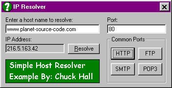



## Easy IP Resolver

### Description

This program will resolve a host name (ex. www.planet-source-code.com) to it's IP address. I've seen some code to do this here on PSC, but they all seems like a hassle so I made a way to do it quickly and easily. The only downfall to my version is that you have to be able to establish a connection with the host in order to get their IP, so it may not work for inactive domain names etc, but then why would you want their IP address anyhow? Enjoy, and leave feedback if you find this useful!
 
### More Info
 
A Host Name

You have to be able to establish a connection with the host in order to get their IP, so it may not work for inactive domain names etc, but then why would you want their IP address anyhow?

A Host's IP Address

             |
---                |---
**Submitted On**   |2001-05-09 14:50:40
**By**             |[Chuck Hall](https://github.com/Planet-Source-Code/PSCIndex/blob/master/ByAuthor/chuck-hall.md)
**Level**          |Beginner
**User Rating**    |4.6 (37 globes from 8 users)
**Compatibility**  |VB 4\.0 \(32\-bit\), VB 5\.0, VB 6\.0
**Category**       |[Internet/ HTML](https://github.com/Planet-Source-Code/PSCIndex/blob/master/ByCategory/internet-html__1-34.md)
**World**          |[Visual Basic](https://github.com/Planet-Source-Code/PSCIndex/blob/master/ByWorld/visual-basic.md)
**Archive File**   |[Easy IP Re19438592001\.zip](https://github.com/Planet-Source-Code/chuck-hall-easy-ip-resolver__1-23068/archive/master.zip)

